<p align="center">
  
</p>

<h1 align="center">ohno</h1>

<p align="center">
  <b>A flight recorder for your codebase.</b><br>
  Automatic snapshots of uncommitted work — instant undo when an AI agent (or you) wrecks it.
</p>

<p align="center">
  <a href="https://github.com/benrwarner/ohno/actions/workflows/ci.yml"></a>
  <a href="https://www.npmjs.com/package/ohno-cli"></a>
  
  = 20">
  <a href="LICENSE"></a>
</p>

---

Git protects what you committed. **Nothing protects what you haven't.**

That gap used to be survivable — you lost your *own* last twenty minutes, occasionally. Now coding agents edit dozens of files a minute, run shell commands, and "refactor" things you didn't ask about. One wrong tool call and hours of uncommitted work is gone, and `git reflog` has never heard of it.

`ohno` closes the gap. It continuously snapshots your working directory into a **shadow git repository** — separate from your real one, which it never reads or writes. When something goes wrong, you get everything back in one command. The command is the thing you were going to say anyway.

## Install

```sh
npm install -g ohno-cli   # the command is just `ohno`
```

Requires Node ≥ 20 and `git` on your PATH. Zero npm dependencies — `ohno` is ~600 lines of plain JavaScript on top of git plumbing.

## 30 seconds to protected

```sh
cd your-project

# Option A: snapshot before every Claude Code file edit & shell command
ohno install claude

# Option B: snapshot automatically on every file change, any editor/agent
ohno watch
```

Then, when it all goes wrong:

```sh
ohno            # what changed since the last snapshot?
ohno undo       # put it all back
```

That's the whole workflow. `ohno undo` first snapshots your current state, so **undo is itself undoable** — `ohno redo` reverses it.

## Commands

| Command | What it does |
|---|---|
| `ohno` | What changed since the last snapshot? |
| `ohno snap -m "before yolo refactor"` | Take a labeled snapshot now |
| `ohno watch` | Auto-snapshot on every file change (debounced, deduped) |
| `ohno log` | The timeline: every snapshot with age, label, and `+/-` stats |
| `ohno diff [id] [file...]` | Diff your working tree against any snapshot |
| `ohno undo [id]` | Restore the working tree to a snapshot (default: latest) |
| `ohno redo` | Bring back what the last undo threw away |
| `ohno restore <id> <file...>` | Surgically restore specific files |
| `ohno install claude` | Hook Claude Code: snapshot before every edit and shell command |
| `ohno list` | Every project ohno is protecting |
| `ohno path` / `ohno reset --force` | Where snapshots live / delete them |

## The AI agent problem, specifically

Coding agents fail in a particular way: **fast, confident, and mid-task** — exactly when your work is least likely to be committed. The classics:

- the "cleanup" that deletes a directory it decided was legacy
- the find-and-replace that touched 40 files instead of 4
- the `git checkout .` or `git reset --hard` an agent runs to "fix" its own mess
- the rewrite that compiles but silently dropped your edge cases

`ohno install claude` adds a [Claude Code hook](https://docs.anthropic.com/en/docs/claude-code/hooks) that snapshots **before every `Write`, `Edit`, `NotebookEdit`, and `Bash` call**. Snapshots are content-deduplicated — if nothing changed, nothing is recorded — so even a chatty agent session stays cheap. Your timeline ends up looking like:

```
a3f81c2  2m ago    claude: pre-edit   +0 -847 (12 files)   ← the disaster
ba5eba1  4m ago    claude: pre-edit   +31 -2 (3 files)
9c01d44  11m ago   claude: pre-edit   +102 -55 (7 files)
f00dbab  26m ago   watch              +12 -3 (2 files)
```

Using Cursor, Codex, aider, or anything else? `ohno watch` in a second terminal protects you from any process that edits files.

## How it works

```
your-project/                          ~/.local/share/ohno/repos/<id>/
├── src/            ── snapshots ──▶   (a bare-ish git repo: objects,
├── .git/      ◀── never touched       refs, index — but no checkout)
└── .gitignore ──── respected ────▶    ignored files are never recorded
```

`ohno` points `GIT_DIR` at a shadow repository and `GIT_WORK_TREE` at your project, then uses ordinary git plumbing: `add -A`, `commit`, `read-tree`, `checkout-index`. Every snapshot is a real commit in the shadow repo, which means:

- **Deduplication, delta compression, and integrity checking for free** — it's git.
- **Your real repo is invisible to it.** Different `GIT_DIR`, different index, system and global git config masked (your hooks, signing, and filters can't fire). Your `.git` is never read, never written, never at risk.
- **`.gitignore` is respected**, so `node_modules`, build artifacts, and secrets you've ignored stay out of snapshots.
- **It's inspectable.** `ohno path` prints the shadow repo; point any git tool at it if you ever want to.

`undo` is not a `reset --hard` — history is never rewritten. Restoring is itself recorded as a new snapshot, so the timeline only ever grows forward and every state remains reachable. The disaster you just undid is one `ohno redo` away if it turns out you needed it.

## ohno vs. the thing you're already doing

| | **ohno** | git commit/stash | dura | IDE local history |
|---|---|---|---|---|
| Works when you forgot to commit | ✅ that's the point | ❌ requires discipline | ✅ | ✅ |
| Snapshot before each AI agent action | ✅ `install claude` | ❌ | ❌ | ❌ |
| Catches `rm -rf` by a shell command | ✅ (hook + watch) | ❌ | ✅ | ❌ saves only on editor events |
| Works outside any IDE | ✅ | ✅ | ✅ | ❌ |
| Touches your real repo | never | yes | writes branches into it | n/a |
| One-command full rollback | ✅ `ohno undo` | ⚠️ if you committed | ❌ manual `git` archaeology | ⚠️ file by file |
| Maintained | ✅ | — | unmaintained since 2022 | — |
| Install | `npm i -g ohno-cli` | — | cargo + daemon setup | — |

## FAQ

**Will it mess with my git repo?**
No. `ohno` never reads or writes your `.git`. It can't create branches, stashes, or reflog entries in it, and your git hooks never fire. This is enforced by construction (`GIT_DIR` points elsewhere), not by carefulness — and covered by tests.

**What about big repos / `node_modules`?**
Snapshots respect `.gitignore`, which already excludes the heavy stuff in any sane project. A snapshot of an unchanged tree is a no-op. Underneath it's git — the same machinery that handles the Linux kernel.

**Where does the data live? Is anything uploaded?**
`~/.local/share/ohno` (or `$OHNO_DIR`). Everything is local. There is no server, no telemetry, no account. `ohno reset --force` deletes a project's snapshots entirely.

**Is `ohno undo` dangerous?**
It's the safest destructive command you'll run all week: it snapshots your current state *first*, so `ohno redo` always brings it back. Nothing is ever rewritten or garbage-collected out from under you.

**Nested git repos / submodules?**
Recorded as commit pointers (the standard git behavior), not their full contents. Run `ohno` inside the nested repo if you want it protected too.

**Why not just commit more often?**
You should! `ohno` is for the gap between intention and reality — and for the agent that wrecks things 40 seconds after your last commit. Snapshots are not commits: they're noise-free (your real history stays clean) and require zero decisions.

**Windows? macOS?**
Yes — CI runs the full suite on Linux, macOS, and Windows.

## Roadmap

- [ ] `ohno prune` — compact snapshots older than N days into daily checkpoints
- [ ] Hooks for more agents (Cursor hooks, OpenAI Codex) as their hook APIs land
- [ ] `ohno watch --daemon` — background service with `ohno watch --status`
- [ ] Interactive timeline picker (`ohno undo` with no args on a clean tree)

PRs welcome — see [CONTRIBUTING.md](CONTRIBUTING.md). The whole codebase is small enough to read over coffee.

## License

[MIT](LICENSE)

---

<p align="center"><i>Named after the only thing anyone has ever said while reaching for it.</i></p>
